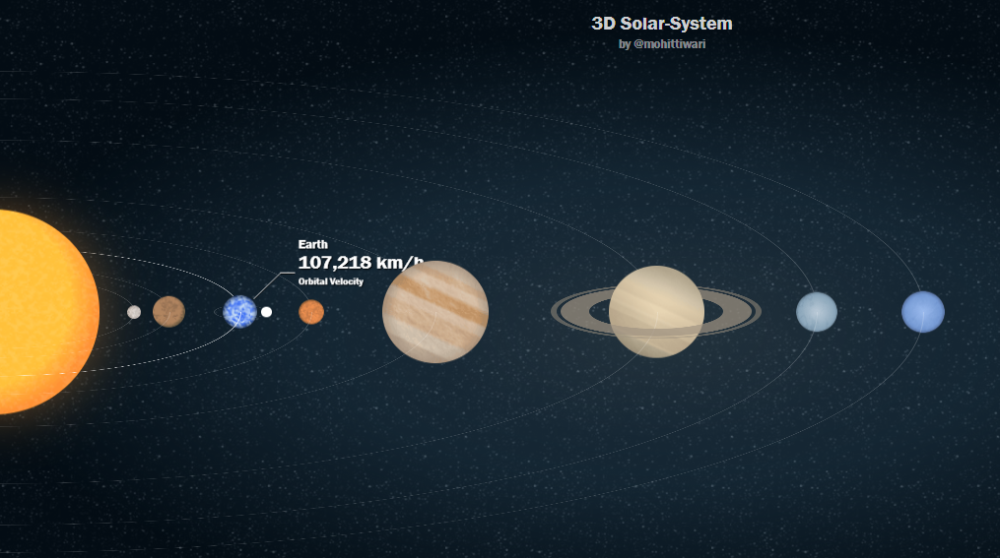
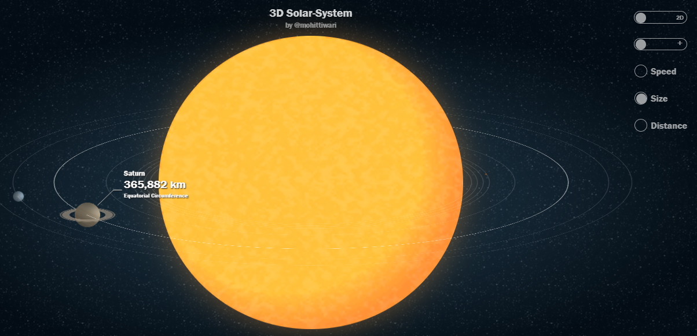
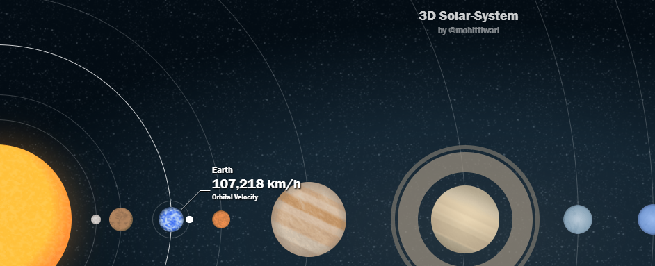
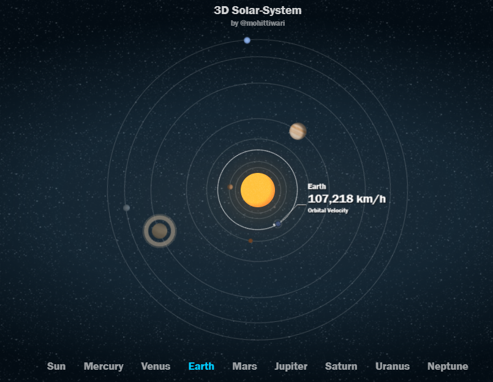

# 3D-solar-system 

  

3D Solar System Visualization

A dynamic and interactive web application that visualizes the Solar System in both 3D and 2D modes, showcasing planetary sizes, orbital speeds, revolution speeds, and the Earth-Moon system's revolution. Built with HTML, Tailwind CSS, and JavaScript, this project leverages Three.js for 3D rendering and provides a toggle to switch between 3D and 2D views.

  

Features

3D and 2D Modes: Toggle between a 3D view (using Three.js) and a 2D top-down view of the Solar System.

Planetary Sizes: Displays planets with relative sizes scaled for visual clarity.

Orbital Speeds: Animates planets moving along their orbits at relative speeds.

Revolution Speeds: Shows each planet's rotation on its axis, with accurate relative periods.

Earth-Moon System: Includes the Moon orbiting Earth with realistic revolution dynamics.

Responsive Design: Adapts to various screen sizes using Tailwind CSS.

Interactive Controls: Allows users to zoom, pan, and toggle modes for an engaging experience.

Dark Mode: A sleek, space-themed dark mode for better visualization.

  

#TECHSTACK

       

  

